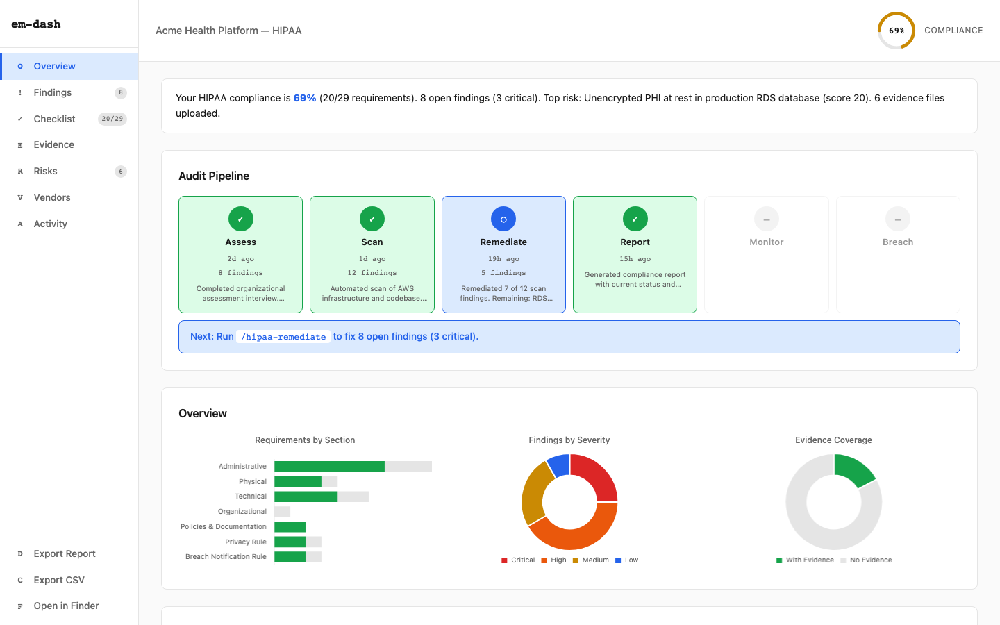

# em-dash

[]()
[](LICENSE)
[]()
[]()
[]()

I'm [Aanish](https://github.com/aanishs). I build [CoralEHR](https://coralehr.com), an EHR for behavioral therapists.

We needed HIPAA compliance.

What we found was an industry that treats compliance like a badge. A nice logo. A dashboard. A procurement accessory. Something to wave around as temporary emotional support.

That would be fine if compliance were decorative. It is not.

It matters because healthcare data is deeply personal. Because one bad workflow, one missing control, one lazy assumption can create a very real mess for very real people. And when that happens, the vendor does not spiritually absorb the consequences on your behalf. They just invoice annually.

[Vanta](https://www.vanta.com/) wants $10k a year. We almost paid [Delve](https://delve.co/). They raised millions. Then [got accused of fabricating compliance evidence](https://techcrunch.com/2026/03/22/delve-accused-of-misleading-customers-with-fake-compliance/). Which is, admittedly, a bold approach to compliance.

But this is not just about one company acting insane in public. It points to a bigger problem. The market got very good at selling the *feeling* of compliance. Much less good at helping teams do the work.

Pay a vendor. Trust the black box. Download the PDF. Hope nobody asks a follow-up question.

Meanwhile, [OCR's most common enforcement finding](https://www.hipaajournal.com/hipaa-violation-cases/) is inadequate risk analysis. So even after all the dashboards, all the checklists, all the very serious security pages, teams are still missing the part that actually matters.

So we built em-dash.

Originally for CoralEHR. Now open source.

Because "pay $10k a year" and "guess" should not be the two main options.

em-dash is Claude Code plus compliance. HIPAA is the first framework — built from real-world experience. The architecture supports multiple frameworks, and early SOC 2 scaffolding is in place, but additional frameworks need domain expertise we don't have yet. Contributors who know SOC 2, GDPR, PCI-DSS, or ISO 27001 are especially welcome.

Our core philosophy is simple: compliance should be human-in-the-loop.

AI is good at finding gaps, drafting fixes, and doing tedious work fast. It is not good at being the final authority on how your company handles sensitive healthcare data.

So em-dash is built to assist, not impersonate judgment. You stay in control. You can inspect everything. You can override everything. Nothing important disappears into a black box and comes back wearing a confidence score.

(Why "em-dash"? The em dash and "delve" are both classic AI tells. LLMs can't stop using them. The Delve scandal pushed us to ship this publicly, so the name just... worked.)

**Who this is for:**
- You handle PHI and don't have a compliance person
- You know you need HIPAA but don't know where to start
- You got burned by vendor lock-in and want to own your compliance
- You want to see your compliance state, not just hear about it

---

## Install

**Requirements:** [Claude Code](https://docs.anthropic.com/en/docs/claude-code), [Git](https://git-scm.com/), [Bun](https://bun.sh/) v1.0+

```bash
cd ~/.claude/skills
git clone https://github.com/aanishs/em-dash.git
cd em-dash && ./setup
```

To add it to a project (so teammates get it automatically):

```bash
cp -Rf ~/.claude/skills/em-dash .claude/skills/em-dash
rm -rf .claude/skills/em-dash/.git
cd .claude/skills/em-dash && ./setup
```

Optional scanning tools (recommended, not required):

```bash
pip install prowler        # AWS — 83 HIPAA checks
brew install trivy         # containers, code, IaC
pip install checkov        # 1000+ IaC rules with HIPAA framework
brew install conftest      # runs em-dash's bundled Rego policies
```

em-dash works without any of these. The 19 code-level checks only need grep. Cloud scanning uses native CLI commands.

## Demo

```
You:    /comply
Claude: Welcome to em-dash. Which compliance framework are you working on?

        A) HIPAA — healthcare, handling patient data (PHI)
        B) SOC 2 — SaaS, service organization trust criteria
        C) GDPR — European data protection regulation
        D) PCI-DSS — payment card data security
        E) Multiple — I need more than one framework

You:    A

Claude: Imported 50 NIST 800-53 controls for HIPAA.
        0% complete. 50 controls pending.
        Run /comply-auto to start.

You:    /comply-auto
Claude: Working on AC-2: Account Management...
        NIST says: "Define and document the types of accounts allowed..."
        Running checks: aws-iam-wildcard ✓ rego-iam-wildcard ✓
        All checks PASS.

        Working on AC-3: Access Enforcement...
        Running checks: rbac-existence... FAIL — no RBAC found
        Fixing: [generates RBAC middleware]
        Re-scan: rbac-existence ✓ PASS

        Working on RA-3: Risk Assessment...
        No automated checks. Interview needed:
        "Have you conducted a formal risk analysis?"

You:    Not yet, it's on our list.

Claude: Recorded. Moving to next control...
        [... continues through all 50 controls ...]

        Session complete: 21 scanned, 12 passed, 5 fixed, 29 need interviews.

You:    /comply-report
Claude: → Signed audit packet: audit-packet.zip
        → 50 controls, 42% complete
        → Ed25519 signed, RFC 8785 canonicalized
```

Need multiple frameworks? Choose E and select which ones — controls are shared automatically (AC-2 satisfies both HIPAA and SOC 2).

## Supported Frameworks

| Framework | Controls | Filter file | What it covers |
|-----------|----------|-------------|----------------|
| **HIPAA** | 50 | `nist/hipaa-filter.json` | Healthcare — PHI protection, security rule, privacy rule |
| **SOC 2** | 40 | `nist/soc2-filter.json` | SaaS — trust service criteria (security, availability, confidentiality) |
| **GDPR** | 22 | `nist/gdpr-filter.json` | EU data protection — privacy rights, data processing, breach notification |
| **PCI-DSS** | 16 | `nist/pci-dss-filter.json` | Payment cards — cardholder data protection, network security |

All frameworks use the same NIST 800-53 catalog (1,196 controls). Many controls overlap — scanning AC-2 for HIPAA also satisfies SOC 2 CC5.2. Adding a new framework = writing a ~50-line JSON file mapping requirements to 800-53 control IDs. Zero code changes.

## Usage

Open Claude Code in any project.

| Command | What it does |
|---------|-------------|
| `/comply` | Status dashboard. Shows compliance score per NIST control, recommends next step. |
| `/comply-auto` | **Autopilot.** Loops through all controls: scans, fixes what it can, asks questions for the rest. |
| `/comply-assess` | Focused interview. One NIST control at a time. Covers vendors, risk, training — all from NIST text. |
| `/comply-scan` | Focused scan. One NIST control at a time. Runs em-dash + Prowler + Checkov. |
| `/comply-fix` | Focused remediation. Picks failed controls, generates fixes, re-scans to verify. |
| `/comply-report` | Compile evidence from SQLite. Generate compliance report + signed audit packet. |
| `/comply-breach` | Incident response. Guided breach notification with 4-factor risk assessment. |

### Architecture

The LLM reads the actual NIST 800-53 control text at runtime — not our interpretation.

```bash
bin/comply-db init                  # import 50 HIPAA controls from NIST 800-53
bin/comply-db status                # compliance status per control
bin/comply-db control AC-2          # show full NIST prose + evidence for one control
bin/comply-attest init-keys         # generate Ed25519 signing keypair
bin/comply-audit-packet \           # generate signed audit packet
  --attestation-dir ~/.em-dash/projects/$SLUG/attestations \
  --output audit-packet.zip
```

**4 frameworks supported:** HIPAA (50 controls), SOC 2 (40), GDPR (22), PCI-DSS (16). Adding a framework = one filter file mapping requirements to 800-53 controls. Zero code changes.

### Workflow

```
/comply           ──> status + recommend next step
/comply-auto      ──> scan → fix → assess → next control (autopilot)
/comply-assess    ──> interview (vendors, risk, training — all NIST-driven)
/comply-scan      ──> automated checks ──┐
/comply-fix       ──> remediate failures ├──> /comply-report ──> audit packet
                                        │
/comply-breach (standalone — use when things go wrong)
```

All evidence lives in SQLite: `~/.em-dash/projects/{slug}/compliance.db`



## What it checks

### Code-level checks (always run, no tools required)

| Check | HIPAA Req | What it finds |
|-------|-----------|---------------|
| PHI identifiers | §164.514 | Patient names, SSNs, MRNs, DOBs, insurance IDs in code |
| Health data fields | §164.501 | Diagnosis codes, medications, lab results, clinical notes |
| PHI in logs | §164.312(b) | `console.log(patient.ssn)` |
| PHI in browser | §164.312(a)(1) | localStorage, cookies, URL params with PHI |
| RBAC | §164.312(a)(1) | Missing role checks on PHI endpoints |
| Audit logging | §164.312(b) | No audit trail for PHI access |
| Encryption at rest | §164.312(a)(2)(iv) | Unencrypted PHI, missing KMS |
| Session timeout | §164.312(a)(2)(iii) | No auto-logoff |
| Password hashing | §164.312(d) | MD5/SHA1 instead of bcrypt/argon2 |
| PHI in tests | §164.502 | Real SSNs in fixtures |
| PHI in errors | §164.312(a)(1) | Stack traces leaking PHI |
| Least privilege | §164.308(a)(4) | Wildcard IAM, hardcoded creds |
| DB columns | §164.502 | PHI column names in schemas |
| DB audit logging | §164.312(b) | Missing pgaudit config |
| DB encryption | §164.312(a)(2)(iv) | No TDE/pgcrypto |
| DB access | §164.312(a)(1) | GRANT ALL, PUBLIC grants |
| DB connections | §164.312(e)(1) | sslmode=disable |
| Push/email PHI | §164.312(a)(1) | PHI on lock screens, unencrypted email |
| Secrets in config | §164.312(a)(1) | Passwords in .env files |

<details>
<summary><strong>Cloud infrastructure scanning (AWS/GCP/Azure)</strong></summary>

| Provider | Checks | Coverage |
|----------|--------|----------|
| AWS | ~65 CLI commands | IAM, MFA, CloudTrail, VPC flow logs, S3/RDS/EBS encryption, KMS, security groups, GuardDuty, WAF, Config, Macie, Inspector, CloudFront TLS, backup immutability |
| GCP | ~40 gcloud commands | Cloud SQL, IAM, service account keys, KMS, firewall, GKE, audit logs, VPC Service Controls, Cloud Armor, DLP, Memorystore, Secret Manager |
| Azure | ~28 az commands | Storage encryption, SQL TDE/auditing, Key Vault, NSG, Defender, App Gateway WAF, Cosmos DB, private endpoints, backup policies |

All commands are read-only.

</details>

<details>
<summary><strong>IaC and scanning tool integrations</strong></summary>

| Tool | What it does |
|------|-------------|
| [Checkov](https://github.com/bridgecrewio/checkov) | 1000+ rules with built-in HIPAA framework. Terraform, CloudFormation, K8s. |
| [Conftest](https://github.com/open-policy-agent/conftest) | Runs em-dash's 6 bundled Rego policies against IaC files. |
| [Prowler](https://github.com/prowler-cloud/prowler) | 83 AWS HIPAA-specific checks. |
| [Trivy](https://github.com/aquasecurity/trivy) | Container, code, and IaC vulnerability scanning. |

All optional. em-dash works with just grep.

</details>

## What it produces

### Dashboard

Run `bun run dashboard` to open the compliance dashboard at localhost:3000.

<!-- TODO: Add dashboard screenshot here -->
<!--  -->

| Feature | Description |
|---------|-------------|
| **NL Summary** | Auto-generated compliance summary: score, open findings, missing BAAs, top risk, next step |
| **Audit Pipeline** | Visual skill status with timestamps, finding counts, and 1-line summaries |
| **Requirements Checklist** | 49 HIPAA items, filterable by section, with evidence linking and notes |
| **Findings** | Expandable rows with severity, description, dates, linked evidence |
| **Risk Register** | 5x5 likelihood/impact matrix + table view with treatment strategies |
| **Vendor Tracker** | BAA status, expiry warnings, risk tiers, notes |
| **Evidence Library** | Drag-and-drop upload, SHA-256 integrity, search, pagination |
| **Export** | HTML compliance report + CSV findings export |

### Reports

| Report | Description |
|--------|-------------|
| **Full Compliance Report** | Every §164 requirement mapped, evidence indexed, corrective action plan |
| **Executive Summary** | 1 page. Compliance maturity score. For leadership. |
| **Trust Report** | Shareable with prospects and partners. Verified controls only. SHA-256 evidence hash. |

### Policy documents

`/comply-fix` generates these from audited templates, customized for your organization:

| Policy |
|--------|
| Access Control Policy |
| Audit Logging Policy |
| Encryption Policy |
| Incident Response Plan |
| Risk Assessment Procedure |
| Workforce Security Policy |
| Contingency Plan |
| Business Associate Agreement (BAA) Template |

Based on [Datica's open-source HIPAA policies](https://github.com/Jowin/policies) (independently audited).

## CI/CD

Scan every PR automatically. Add the `hipaa-scan` label to trigger a compliance check via GitHub Actions.

```yaml
# .github/workflows/comply-scan.yml is included — just add your API key:
# Settings → Secrets → ANTHROPIC_API_KEY
```

See [docs/ci-setup.md](docs/ci-setup.md) for full setup instructions.

## How em-dash compares

|  | em-dash | Vanta | Drata | Comp AI |
|--|---------|-------|-------|---------|
| **Price** | Free | $10k+/yr | $10k+/yr | Free (open core) |
| **Open source** | MIT | No | No | Yes |
| **Runs locally** | Yes | No | No | No |
| **AI-powered** | Claude Code agent | Dashboard + integrations | Dashboard + integrations | AI agents |
| **See every action** | Yes (terminal) | No (black box) | No (black box) | Partial |
| **Code scanning** | 19 checks + Prowler/Trivy/Checkov | Via integrations | Via integrations | Via integrations |
| **Policy generation** | 9 templates, auto-customized | Templates | Templates | Templates |
| **Evidence integrity** | SHA-256 hashed | Vendor-managed | Vendor-managed | Self-hosted |
| **Remediation** | AI generates fixes + Terraform patches | Manual guidance | Manual guidance | AI suggestions |
| **Multi-framework** | HIPAA (SOC 2 scaffolding, GDPR/PCI-DSS planned) | HIPAA, SOC 2, ISO, GDPR | HIPAA, SOC 2, ISO, GDPR | SOC 2, ISO, HIPAA, GDPR |

## Roadmap

HIPAA is shipped and tested against real infrastructure. The multi-framework architecture is in place — a shared checks registry (~50 checks), framework-agnostic Rego policies, and a template engine that generates framework-specific skills from JSON definitions.

**Multi-framework support:** HIPAA, SOC 2, GDPR, and PCI-DSS filter files exist (`nist/*-filter.json`). Adding a new framework = writing a ~50-line JSON file mapping requirements to 800-53 controls. Same NIST catalog, same tools, zero code changes. Contributors who know SOC 2, GDPR, PCI-DSS, or ISO 27001 can improve the filter accuracy.

**What we need help with:**
- **SOC 2** — Trust Service Criteria mappings, assessment questions, checklist refinement
- **GDPR** — Article 32 technical measures, data subject rights workflows, DPA tracking
- **PCI-DSS** — Cardholder data environment scoping, SAQ mapping, network segmentation checks
- **ISO 27001** — Annex A control mapping, ISMS documentation templates

Adding a framework: write `frameworks/<id>.json` (~200 lines of requirement mappings), create skill directories, run `bun run gen:skill-docs`. See [CONTRIBUTING.md](CONTRIBUTING.md) — "Adding a new compliance framework."

## Disclaimer

> This is technical guidance, not legal advice. It does not constitute HIPAA certification. Consult qualified legal counsel and consider engaging a certified HIPAA auditor for formal compliance verification.

## Documentation

| Document | Description |
|----------|-------------|
| [docs/guide.md](docs/guide.md) | Visual usage guide with screenshots of every page |
| [docs/design.md](docs/design.md) | Design system reference (colors, typography, components, Chart.js) |
| [CONTRIBUTING.md](CONTRIBUTING.md) | Project architecture, contribution paths, testing guide |
| [CHANGELOG.md](CHANGELOG.md) | Release notes |
| [SECURITY.md](SECURITY.md) | Vulnerability reporting |
| [CLAUDE.md](CLAUDE.md) | Development reference |

## Troubleshooting

**Skills not showing up?** `cd ~/.claude/skills/em-dash && ./setup`

**Tests failing after pulling?** `bun install && bun run gen:skill-docs`

**Scanning tools not detected?** Verify they're in your PATH: `which prowler`

**Assessment seems stuck?** Say "continue the assessment." It picks up from saved state in `~/.em-dash/`.

## License

[MIT](LICENSE)
