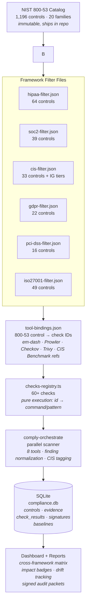
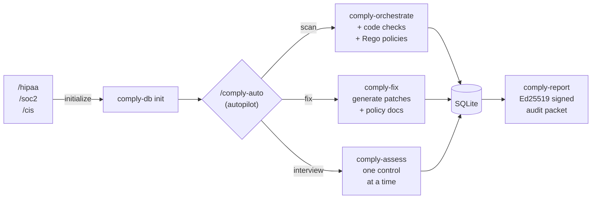
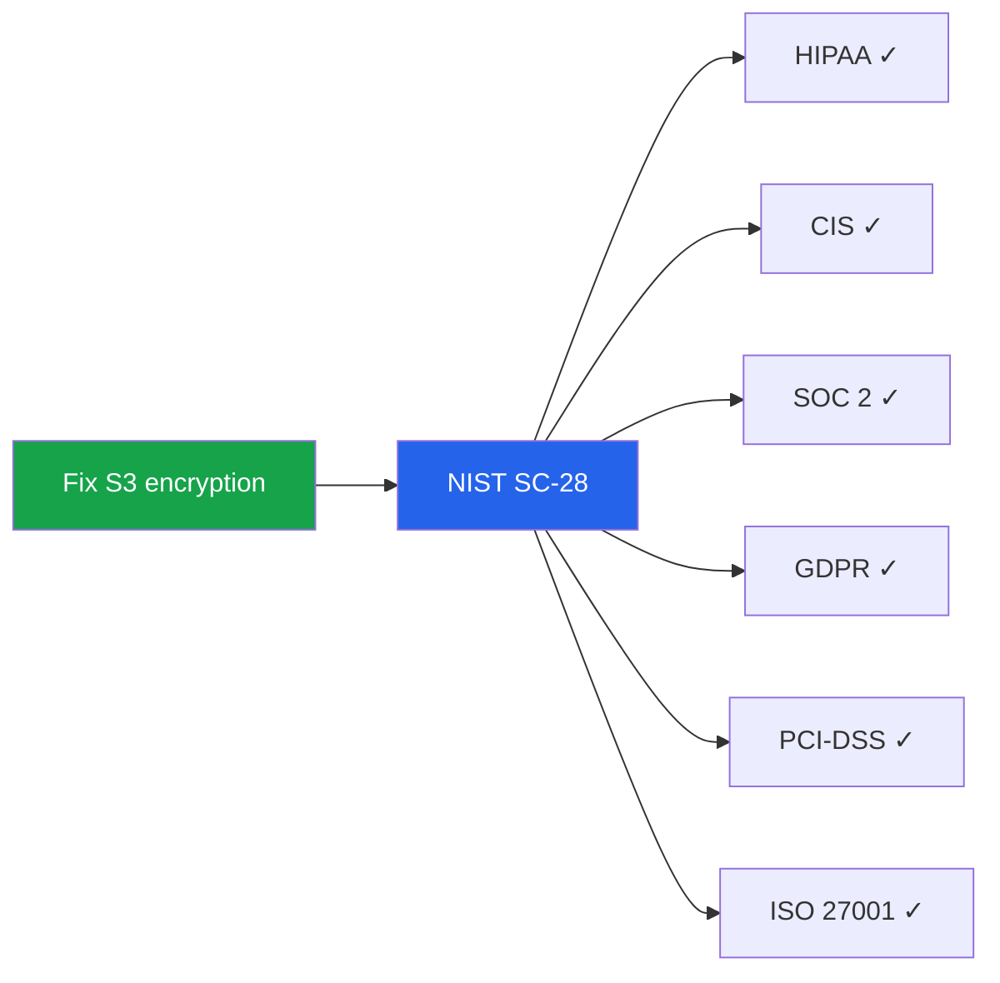
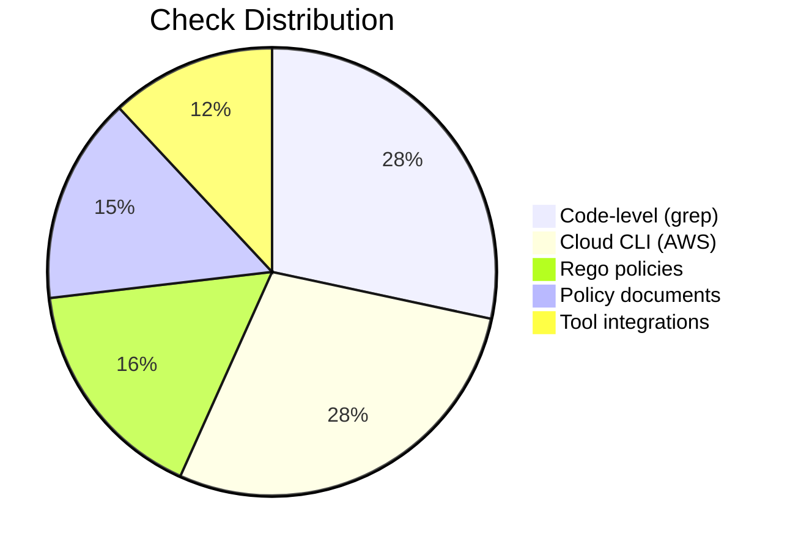
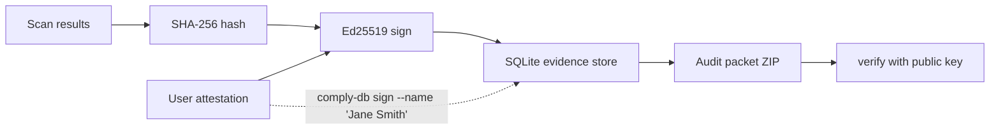

# em-dash

[]()
[](LICENSE)
[]()
[]()
[]()
[]()

I'm [Aanish](https://github.com/aanishs). I build [CoralEHR](https://coralehr.com), an EHR for behavioral therapists.

We needed HIPAA compliance.

What we found was an industry that treats compliance like a badge. A nice logo. A dashboard. A procurement accessory. Something to wave around as temporary emotional support.

That would be fine if compliance were decorative. It is not.

It matters because healthcare data is deeply personal. Because one bad workflow, one missing control, one lazy assumption can create a very real mess for very real people. And when that happens, the vendor does not spiritually absorb the consequences on your behalf. They just invoice annually.

[Vanta](https://www.vanta.com/) wants $10k a year. We almost paid [Delve](https://delve.co/). They raised millions. Then [got accused of fabricating compliance evidence](https://techcrunch.com/2026/03/22/delve-accused-of-misleading-customers-with-fake-compliance/). Which is, admittedly, a bold approach to compliance.

But this is not just about one company acting insane in public. It points to a bigger problem. The market got very good at selling the *feeling* of compliance. Much less good at helping teams do the work.

Pay a vendor. Trust the black box. Download the PDF. Hope nobody asks a follow-up question.

Meanwhile, [OCR's most common enforcement finding](https://www.hipaajournal.com/hipaa-violation-cases/) is inadequate risk analysis. So even after all the dashboards, all the checklists, all the very serious security pages, teams are still missing the part that actually matters.

So we built em-dash.

Originally for CoralEHR. Now open source.

Because "pay $10k a year" and "guess" should not be the two main options.

em-dash is Claude Code plus compliance. You pick your frameworks. The AI reads the actual law, scans your infrastructure, finds gaps, drafts fixes, and produces cryptographically signed evidence. You stay in control. You can inspect everything. Nothing disappears into a black box.

(Why "em-dash"? The em dash and "delve" are both classic AI tells. LLMs can't stop using them. The Delve scandal pushed us to ship this publicly, so the name just... worked.)

---

## Install

**Requirements:** [Claude Code](https://docs.anthropic.com/en/docs/claude-code), [Git](https://git-scm.com/), [Bun](https://bun.sh/) v1.0+

```bash
cd ~/.claude/skills
git clone https://github.com/aanishs/em-dash.git
cd em-dash && ./setup
```

To vendor into a project:

```bash
cp -Rf ~/.claude/skills/em-dash .claude/skills/em-dash
rm -rf .claude/skills/em-dash/.git
cd .claude/skills/em-dash && ./setup
```

---

## How it works

You opt into the frameworks you need. em-dash only shows what you asked for.

```bash
You:    /hipaa          # → active_frameworks: ["hipaa"]
You:    /cis            # → active_frameworks: ["hipaa", "cis"]
```

Dashboard, CLI, cross-framework matrix, and scan results are all scoped to your active frameworks. Nothing shows up unless you initialized it.

### The mapping chain

Every framework maps its requirements to NIST 800-53 controls. The same controls power all 6 frameworks — so a single infrastructure fix can satisfy requirements across multiple compliance regimes simultaneously.



### The compliance workflow



### Cross-framework impact

Because all frameworks converge on the same 800-53 controls, fixing one thing can satisfy requirements across all your active frameworks at once:



```
$ bin/comply-db cross-framework

Control  CIS       HIPAA     ISO27001  Impact
──────────────────────────────────────────────
AC-2       ✓         ✓         ✓       3/3
SC-28      ✓         ✓         ✓       3/3
AU-2       ✓         ✓         ✓       3/3
```

Only your active frameworks appear. Use `--all` to see all 6.

---

## Six frameworks

| Command | Framework | Controls | What it protects |
|---------|-----------|----------|------------------|
| `/hipaa` | HIPAA Security Rule | 64 | Patient health data (PHI) |
| `/soc2` | SOC 2 Type II | 39 | SaaS trust criteria |
| `/gdpr` | GDPR | 22 | EU personal data |
| `/pci-dss` | PCI-DSS v4.0 | 16 | Payment card data |
| `/cis` | CIS Controls v8.1 | 33 | Infrastructure security baseline |
| `/iso27001` | ISO/IEC 27001:2022 | 49 | Information security management |

Run multiple — each adds to your `active_frameworks` list. Controls are shared automatically.

```bash
bin/comply-db frameworks              # list active frameworks
bin/comply-db frameworks --add soc2   # add without full init
bin/comply-db frameworks --remove cis # remove a framework
```

---

## Skills (Claude Code slash commands)

| Command | What it does |
|---------|-------------|
| `/comply` | Status dashboard — compliance score, next step recommendation |
| `/comply-auto` | **Autopilot.** Scans, fixes, interviews — one control at a time |
| `/comply-scan` | Run all available scanning tools in parallel |
| `/comply-fix` | Remediate failures, generate policy docs, re-scan to verify |
| `/comply-assess` | Focused interview — one NIST control at a time |
| `/comply-report` | Compliance report + Ed25519 signed audit packet |
| `/comply-breach` | Guided incident response and breach notification |
| `/em-dashboard` | Visual compliance dashboard at localhost:3000 |

---

## 60+ automated checks



**Code-level (19):** PHI in logs/browser/tests/errors, RBAC, audit logging, encryption, session timeout, password hashing, least privilege, secrets in config, DB security. No tools required.

**Cloud infrastructure (19):** IAM, MFA, CloudTrail, VPC flow logs, S3/RDS/EBS/DynamoDB encryption, KMS rotation, security groups, GuardDuty, Security Hub.

**Rego policies (11 across 8 files):** Terraform/K8s IaC validation. Multi-cloud: AWS, GCP, Azure. Encryption, access control, audit logging, transmission security, backup/DR, container security, secrets.

**Policy document checks (10):** Partial automation for interview-only controls. Finds evidence of incident response plans, security policies, training records. Finding a doc doesn't auto-pass — it records evidence and marks the control as 'partial'.

**Tool integrations (8):** Orchestrated via `comply-orchestrate`:

| Tool | What it scans |
|------|---------------|
| [Prowler](https://github.com/prowler-cloud/prowler) | AWS CIS/HIPAA/PCI-DSS (83+ checks) |
| [Checkov](https://github.com/bridgecrewio/checkov) | Terraform, CloudFormation, K8s (1000+ rules) |
| [Trivy](https://github.com/aquasecurity/trivy) | Containers, IaC, secrets, SBOM |
| [KICS](https://github.com/Checkmarx/kics) | IaC scanning (2400+ Rego queries) |
| [Semgrep](https://github.com/semgrep/semgrep) | SAST code scanning |
| [kube-bench](https://github.com/aquasecurity/kube-bench) | CIS Kubernetes Benchmark |
| [ScoutSuite](https://github.com/nccgroup/ScoutSuite) | Multi-cloud security audit |
| [Lynis](https://github.com/CISOfy/lynis) | System security auditing |

All optional. em-dash works with just grep. Tools are auto-detected and run in parallel.

---

## Evidence and signing



- **Ed25519 signed attestations** — RFC 8785 JSON canonicalization
- **User signatures** — named person cryptographically attests evidence accuracy
- **Evidence redaction** — `--redact` flag strips AWS account IDs, ARNs, IPs from audit packets
- **Compliance drift** — baseline snapshots track per-framework score changes over time

---

## Dashboard

`bun run dashboard` — visual compliance at localhost:3000.

| Feature | Description |
|---------|-------------|
| **Cross-Framework Matrix** | Controls shared across your active frameworks with impact badges |
| **Requirements Checklist** | Filterable by section, evidence linking, notes |
| **Findings** | Severity, description, dates, linked evidence |
| **Risk Register** | 5x5 likelihood/impact matrix |
| **Vendor Tracker** | BAA status, expiry warnings, risk tiers |
| **Evidence Library** | Drag-and-drop upload, SHA-256 integrity |
| **Compliance Score** | Per-family breakdown from SQLite |
| **Scan Trigger** | Start orchestrator scans from the dashboard |

The dashboard is framework-aware — it only shows frameworks you've initialized. Evidence upload dropdown, charts, and NL summary all scope to your active frameworks.

---

## CLI tools

```bash
# Framework management
bin/comply-db init --framework hipaa    # initialize HIPAA (adds to active list)
bin/comply-db frameworks                 # list active + available frameworks
bin/comply-db frameworks --add cis       # add framework to active list

# Compliance operations
bin/comply-db status                     # compliance status per control
bin/comply-db control AC-2               # NIST prose + evidence for one control
bin/comply-db cross-framework            # cross-framework matrix (active only)
bin/comply-db cross-framework --all      # show all 6 frameworks
bin/comply-db cis-coverage               # CIS AWS Level 1 coverage gap report
bin/comply-db sign AC-2 --name "Jane"    # Ed25519 user attestation

# Scanning
bin/comply-orchestrate detect            # list available tools + versions
bin/comply-orchestrate scan              # run all tools, write to SQLite
bin/comply-orchestrate diff              # compliance drift with per-framework breakdown

# Signing
bin/comply-attest init-keys              # generate Ed25519 keypair
bin/comply-audit-packet --output audit.zip --redact
```

---

## Architecture

```
em-dash/
├── nist/                              # IMMUTABLE — official NIST data
│   ├── NIST_SP-800-53_rev5_catalog.json  # 1,196 controls, 20 families
│   ├── {hipaa,soc2,gdpr,pci-dss,cis,iso27001}-filter.json  # 6 framework filters
│   ├── tool-bindings.json             # control → check mappings (v3.0)
│   └── cross-framework.ts             # shared cross-framework matrix module
├── frameworks/
│   ├── checks-registry.ts             # 60+ checks (pure execution)
│   ├── schema.ts                      # TypeScript interfaces
│   └── {hipaa,soc2,gdpr,pci-dss,cis,iso27001}.json  # display metadata
├── policies/                          # 8 Rego policy files (multi-cloud)
├── bin/                               # 7 CLI utilities
├── scripts/                           # dashboard server, filter validators
├── dashboard/                         # visual dashboard (HTML/CSS/JS)
├── skills/                            # 8 Claude Code skills + 6 framework routers
└── test/                              # 141 tests across 8 files
```

**Key design decisions:**
- **NIST 800-53 is the law** — official catalog ships unmodified
- **SQLite is the evidence store** — one DB per project, tracks `active_frameworks`
- **Framework-aware opt-in** — only show what you initialized
- **checks-registry is pure execution** — no compliance mappings
- **tool-bindings is the mapping layer** — controls → checks + CIS Benchmark refs
- **Adding a framework = one filter file** — zero code changes

---

## How em-dash compares

|  | em-dash | Vanta | Drata |
|--|---------|-------|-------|
| **Price** | Free (MIT) | $10k+/yr | $10k+/yr |
| **Frameworks** | 6 (HIPAA, SOC 2, GDPR, PCI-DSS, CIS, ISO 27001) | HIPAA, SOC 2, ISO, GDPR | HIPAA, SOC 2, ISO, GDPR |
| **Cross-framework** | Yes — shared 800-53 controls, scoped to your selection | No | No |
| **Runs locally** | Yes | No (SaaS) | No (SaaS) |
| **Scanning** | 60+ checks + 8 tool integrations | Via integrations | Via integrations |
| **Evidence integrity** | Ed25519 signed, SHA-256 hashed, user attestations | Vendor-managed | Vendor-managed |
| **Remediation** | AI generates fixes + re-verifies | Manual guidance | Manual guidance |
| **See every action** | Yes (terminal + dashboard) | No (black box) | No (black box) |

---

## Contributing

Adding a framework: write `nist/<id>-filter.json`, write `frameworks/<id>.json`, run `bin/comply-db init --framework <id>`. See [CONTRIBUTING.md](CONTRIBUTING.md).

**What we need help with:**
- **SOC 2** — Trust Service Criteria mapping accuracy
- **GDPR** — Article 32 technical measures, data subject rights
- **PCI-DSS** — Cardholder data environment scoping
- **ISO 27001** — Annex A control mapping completeness

## Disclaimer

> This is technical guidance, not legal advice. It does not constitute compliance certification. Consult qualified legal counsel for formal compliance verification.

## License

[MIT](LICENSE)
