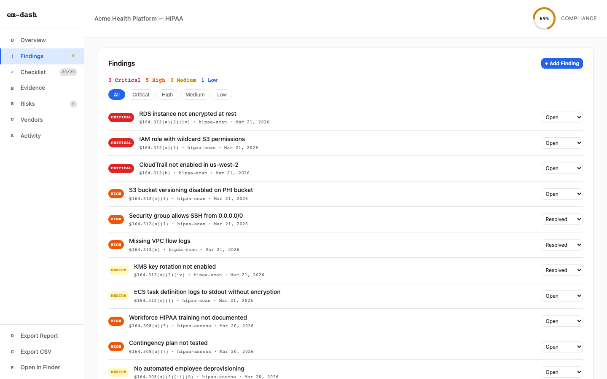
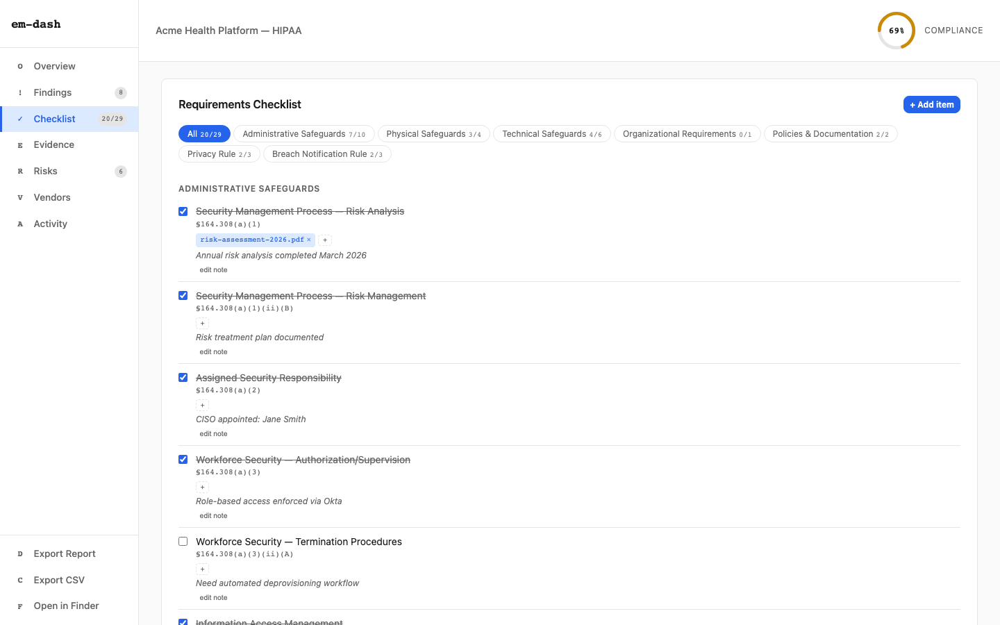
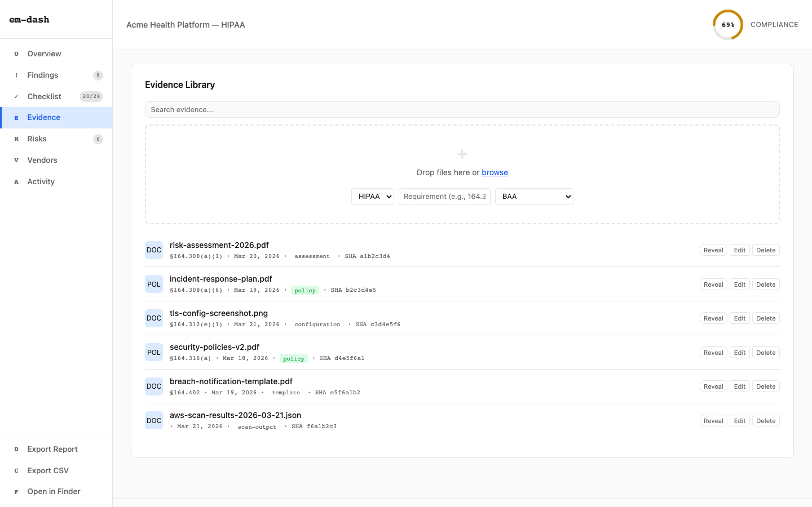
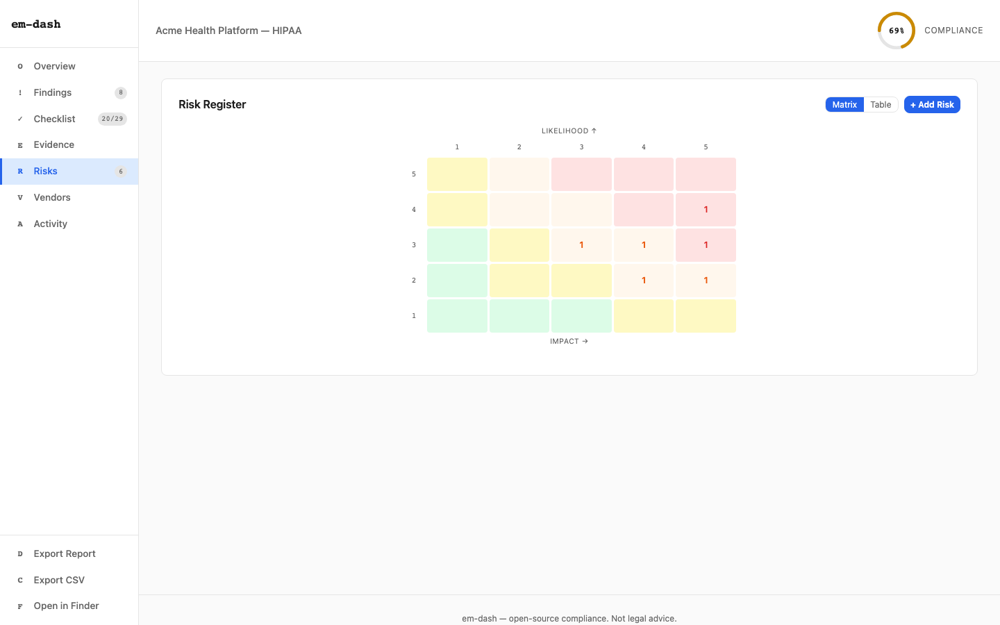
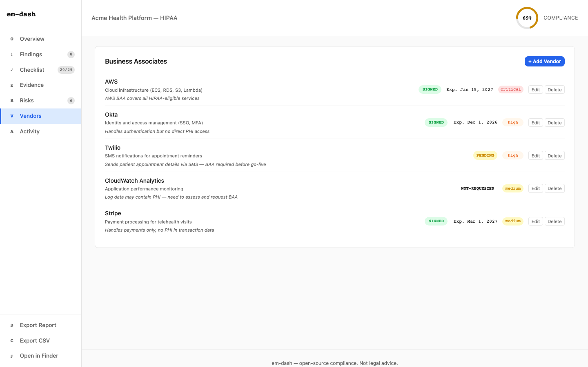
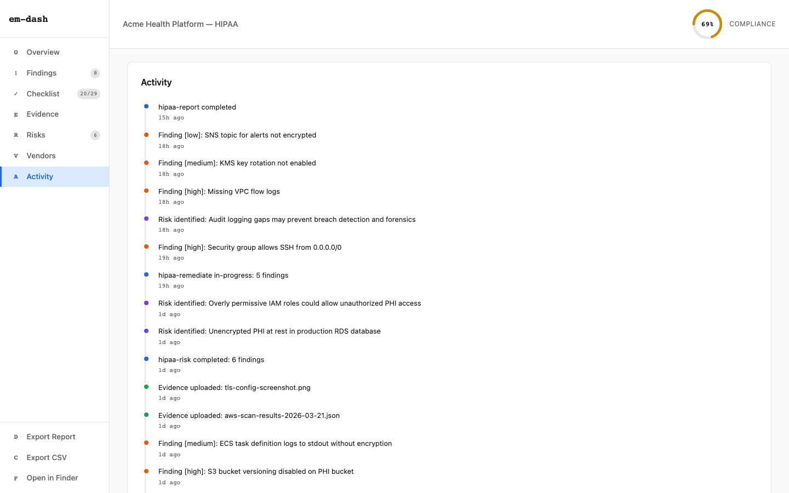

# em-dash usage guide

A visual walkthrough of the em-dash compliance dashboard. Every screenshot shows real data from a HIPAA assessment of a healthcare application.

## Opening the dashboard

```bash
# From Claude Code:
/em-dashboard

# Or directly:
bun run dashboard
# → http://localhost:3000
```

## Overview


The overview is your compliance home screen. Everything you need in one glance:

- **Compliance ring** (top right) — your overall HIPAA score. Color-coded: green (80%+), yellow (60–79%), red (<60%).
- **NL summary** — a plain-English sentence describing your current state: score, open findings, top risk, evidence count.
- **Audit pipeline** — the 6-stage compliance workflow. Green = complete, blue = in-progress, dimmed = not yet run. Each step shows when it last ran, how many findings it produced, and a summary. The blue banner at the bottom tells you exactly what to run next.
- **Charts** — three at-a-glance visualizations:
  - **Requirements by Section** — horizontal bars showing compliance per HIPAA safeguard category
  - **Findings by Severity** — doughnut chart breaking down critical/high/medium/low
  - **Evidence Coverage** — doughnut showing which requirements have supporting evidence
- **Evidence gaps** — specific documents you still need to collect, with the HIPAA section reference

## Findings



Every compliance issue discovered by `/hipaa-assess` and `/hipaa-scan` lands here.

- **Summary line** — count by severity at the top (e.g. "3 Critical, 5 High, 3 Medium, 1 Low")
- **Filter tabs** — click `All`, `Critical`, `High`, `Medium`, or `Low` to filter
- **Finding rows** — each row shows:
  - Severity badge (color-coded pill)
  - Title
  - HIPAA requirement reference (e.g. `§164.312(a)(1)`)
  - Source skill (e.g. `hipaa-scan`)
  - Discovery date
  - Status dropdown (`Open` / `In Progress` / `Resolved`)
- **Expand a finding** — click any title to reveal the full description, resolution dates, and linked evidence files
- **Add Finding** — manually add findings that automated scans don't catch

## Checklist



The 29-item HIPAA requirements checklist. This is what an auditor walks through.

- **Section tabs** — filter by safeguard category: Administrative, Physical, Technical, Organizational, Policies & Documentation, Privacy Rule, Breach Notification Rule
- **Progress counter** — shows completion (e.g. "20/29")
- **Each item** shows:
  - Checkbox (checked = compliant, strikethrough title)
  - HIPAA section reference
  - Linked evidence files (clickable tags)
  - Notes (editable — click "edit note" to add context)
- Skills automatically check items off as they complete. You can also manually toggle any item.

## Evidence library



Your compliance evidence vault. Every document that supports your HIPAA posture.

- **Search** — filter evidence by filename
- **Upload** — drag and drop files into the upload zone, or click "browse." Select the framework, requirement, and document type before uploading.
- **Each file** shows:
  - Type badge (`DOC` for documents, `POL` for policies)
  - Filename
  - HIPAA requirement mapping
  - Upload date
  - Document type tag (policy, assessment, configuration, template, scan-output)
  - SHA-256 hash (integrity verification)
- **Actions** — `Reveal` opens the file in Finder, `Edit` updates metadata, `Delete` removes it
- Evidence is stored in `.em-dash/evidence/` and hashed with SHA-256 for tamper detection.

## Risk register



NIST SP 800-30 risk assessment with a visual heatmap.

- **Matrix view** — 5x5 likelihood-vs-impact grid. Colors range from green (low risk) to red (critical). Numbers in cells show how many risks fall at each intersection.
- **Table view** — click "Table" to see the full list: description, likelihood, impact, score, treatment strategy, owner, and controls.
- **Add Risk** — manually register risks beyond what `/hipaa-risk` discovers.
- Risk scores: likelihood (1–5) x impact (1–5) = score (1–25). Treatment options: mitigate, accept, transfer, avoid.

## Vendors / business associates



Track every third-party vendor that touches PHI.

- **Each vendor** shows:
  - Name, service description, contact
  - Notes (e.g. "AWS BAA covers all HIPAA-eligible services")
  - BAA status badge: `SIGNED`, `PENDING`, or `NOT-REQUESTED`
  - BAA expiry date (with warnings for approaching/expired)
  - Risk tier: `critical`, `high`, `medium`, or `low`
- **Add Vendor** — register new vendors with full BAA tracking
- **Edit / Delete** — update vendor details or remove them
- `/hipaa-vendor` auto-detects services from your codebase and infrastructure.

## Activity



A chronological timeline of everything that has happened in your compliance journey.

- **Event types**:
  - Skill runs (e.g. "hipaa-report completed")
  - Findings discovered (with severity)
  - Risks identified
  - Evidence uploaded
  - Vendors added
- **Timestamps** — relative format ("14h ago", "1d ago")
- Events are auto-generated from all data in the dashboard. No manual logging required.

## Exports

The sidebar has three export actions:

| Action | Shortcut | What it does |
|--------|----------|-------------|
| **Export Report** | `D` | Downloads a styled HTML compliance report — printable, shareable with auditors |
| **Export CSV** | `C` | Downloads findings as a CSV spreadsheet |
| **Open in Finder** | `F` | Opens the `.em-dash/` project directory in your system file manager |

## Keyboard shortcuts

Navigate the entire dashboard without touching the mouse:

| Key | Action |
|-----|--------|
| `O` | Overview |
| `!` | Findings |
| `✓` | Checklist |
| `E` | Evidence |
| `R` | Risks |
| `V` | Vendors |
| `A` | Activity |
| `D` | Export Report |
| `C` | Export CSV |
| `F` | Open in Finder |

## Live reload

The dashboard uses WebSocket to auto-refresh when any skill updates `dashboard.json`. Run `/hipaa-scan` in one terminal, and watch findings appear in the dashboard in real time.
